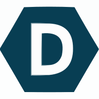

<b>⚡ Bonjour !!</b>
  <h2 align=center>

  </h2>

  
  
  
  
  
  

  
  
  
  
  
  
  
    

  

## 👋 About myself ...

**Web developer** | **ML Enthusiast** | **Problem Solver** | **Hackathon freak**

- Dedicated computer science student currently in my **sophomore year**.
- Passionate about **Python based Web Dev**, **Machine Learning**, **Deep learning**
- **Hackathons**? Count me in !!

<h2> 📊 My Stats ...</h2>
  

#### 🌱 I’m currently ...

... delving deeper into the realms of Machine Learning, exploring **Deep Learning** and **Computer Vision**, and keeping up with the latest trends and developments in the field of **AI**.

#### 👯 I’m looking to collaborate on ...

... exciting projects related to both **Web Dev** and **Machine Learning**. I am looking forward to participating in more **hackathons** and contributing to **open source**. Let's connect, collaborate, and make a significant impact together!

## 💡 My Stack ...
#### 💽 Languages

  
  
  
  
  
  
  
   

#### 🛰 Technologies

  
  
  
  
  
  

#### 📚 Frameworks

  
  
  
  
  

#### 🗃 Databases

  
  

    
  ## 🚀 My Projects ...

<h2></h2>

### 🎉 Fun fact ... 

Solving rubik's cubes  is my favourite way to relax, after long hours of coding !!

<h2></h2>

### 🧩 My Holopin badges (from Hacktoberfest'23 and MLH) ...

<b>⚡ Committed to progress </b>

